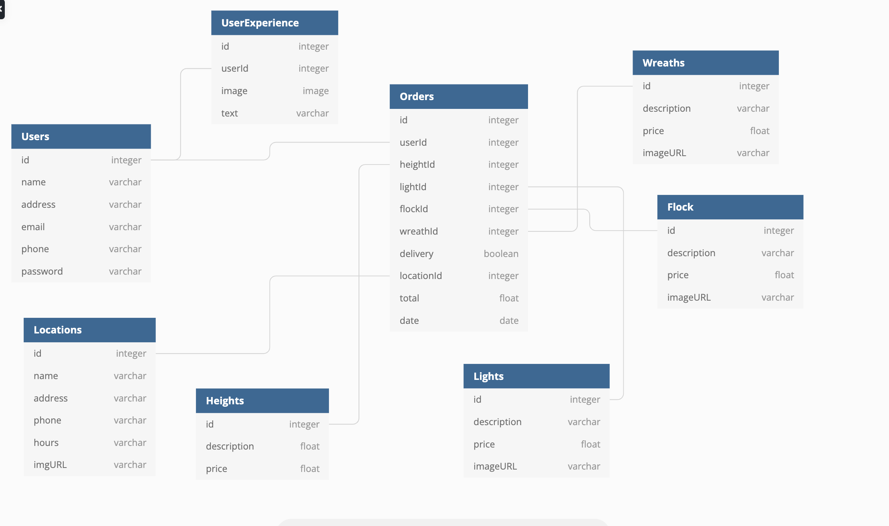

## Tree Farm

<b style="font-size: 20px;"><i>Trees from us to you</i></b>

### Project Description

Tree Farm is the simulated online presence of an imaginary Christmas tree farm that has vertically integrated the retail process by setting up seasonal retail locations in various cities as well as running a choose and cut operation. The application modernizes this approach by offering online orders at the retail locations while also serving as a source for pertinent information regarding the farm generally. 

This application build was undertaken with the intention to gain practical experience with creating a React JS application from scratch, including Create, Read, Update, and Delete functionality while also practicing the single responsibility principle and attempting to write responsive and attractive CSS. 

### Features

• Users can login. 
• Users can view and edit account details. • Users can place and view orders.

### Technologies Used

       

#### ERD

#### by Ashley Dickey

 

